# Diagrammes Mermaid - Fire Detection System

**Pour visualiser ces diagrammes :**
1. Copier le code
2. Aller sur https://mermaid.live/
3. Coller le code dans l'éditeur
4. Le diagramme s'affiche automatiquement
5. Exporter en PNG/SVG

---

## 1. Architecture Globale du Système

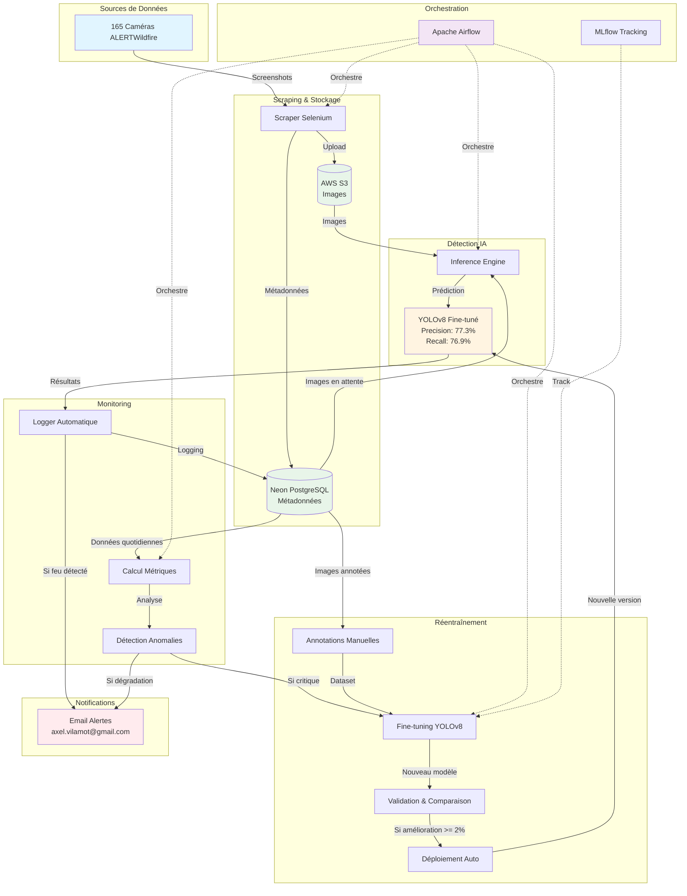

---

## 2. DAG: fire_detection_pipeline (Toutes les 15 minutes)

```mermaid
graph LR
    START([Démarrage<br/>Toutes les 15 min]) --> SCRAPE[Scrape 165 Caméras]
    SCRAPE --> S3_UPLOAD[Upload S3 +<br/>Insert PostgreSQL]
    S3_UPLOAD --> GET_PENDING[Récupérer Images<br/>status = NEW]
    GET_PENDING --> CHECK_EMPTY{Images<br/>en attente ?}
    CHECK_EMPTY -->|Non| END1([Fin])
    CHECK_EMPTY -->|Oui| LOOP_START[Pour chaque image]
    LOOP_START --> DOWNLOAD[Télécharger depuis S3]
    DOWNLOAD --> INFERENCE[Inférence YOLOv8<br/>conf >= 0.4]
    INFERENCE --> LOG[Logger dans<br/>model_predictions]
    LOG --> CHECK_FIRE{Feu<br/>détecté ?}
    CHECK_FIRE -->|Non| UPDATE_DB[Update images<br/>status = ANALYZED]
    CHECK_FIRE -->|Oui| SEND_EMAIL[📧 Envoyer Email<br/>Alerte Incendie]
    SEND_EMAIL --> UPDATE_DB
    UPDATE_DB --> CHECK_MORE{Plus<br/>d'images ?}
    CHECK_MORE -->|Oui| LOOP_START
    CHECK_MORE -->|Non| END2([Fin])

    style SCRAPE fill:#e1f5ff
    style INFERENCE fill:#fff4e1
    style SEND_EMAIL fill:#ffebee
    style LOG fill:#e8f5e9
```

---

## 3. DAG: model_monitoring_daily (Tous les jours à 9h)

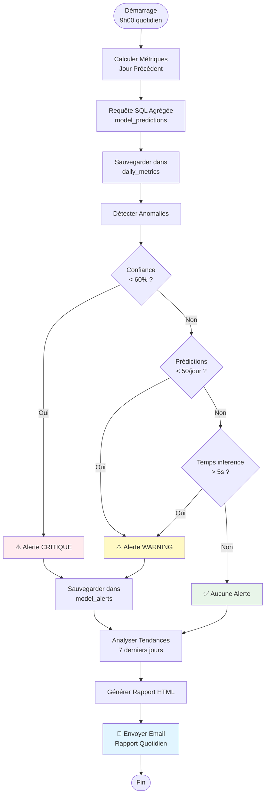

---

## 4. DAG: model_retraining (Déclenchement manuel)

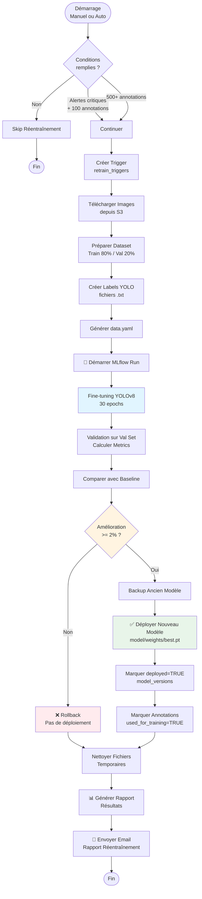

---

## 5. Flux de Données - Scraping vers Inference

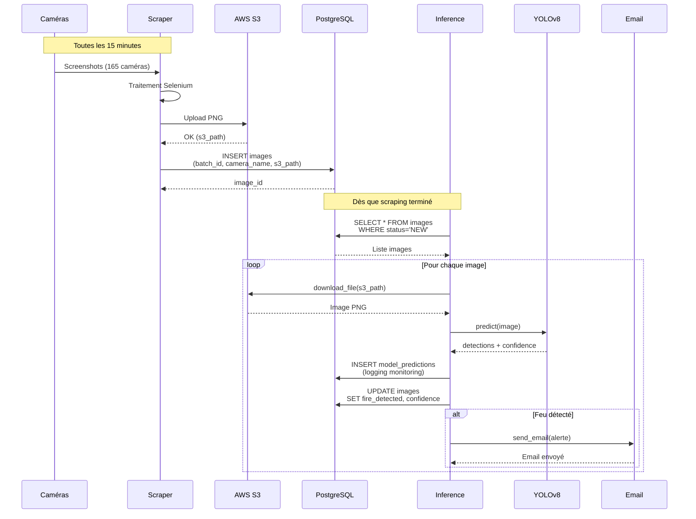

---

## 6. Flux de Monitoring Quotidien

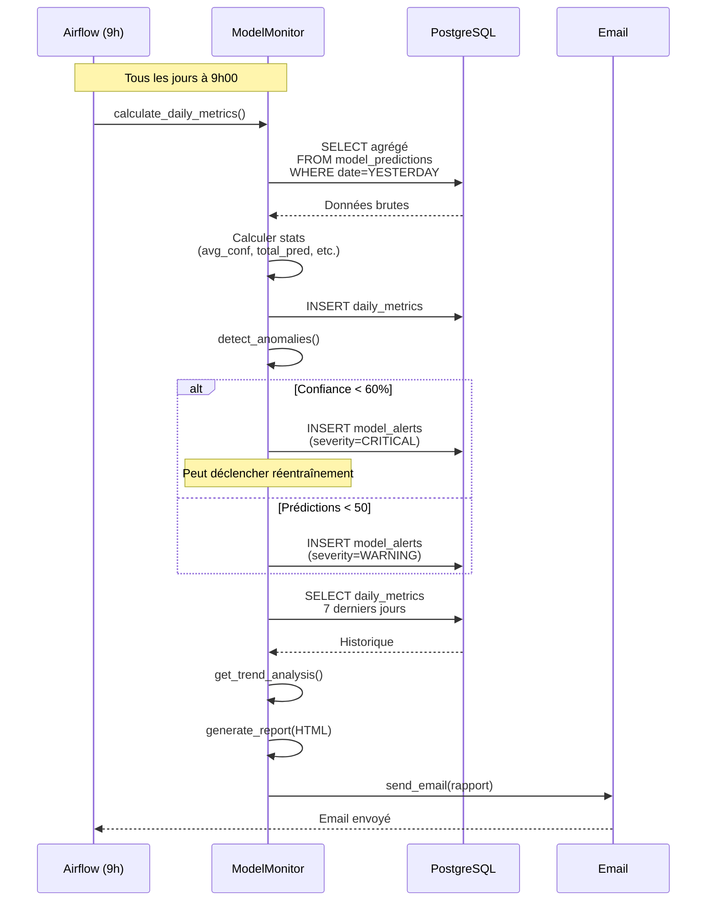

---

## 7. Flux de Réentraînement

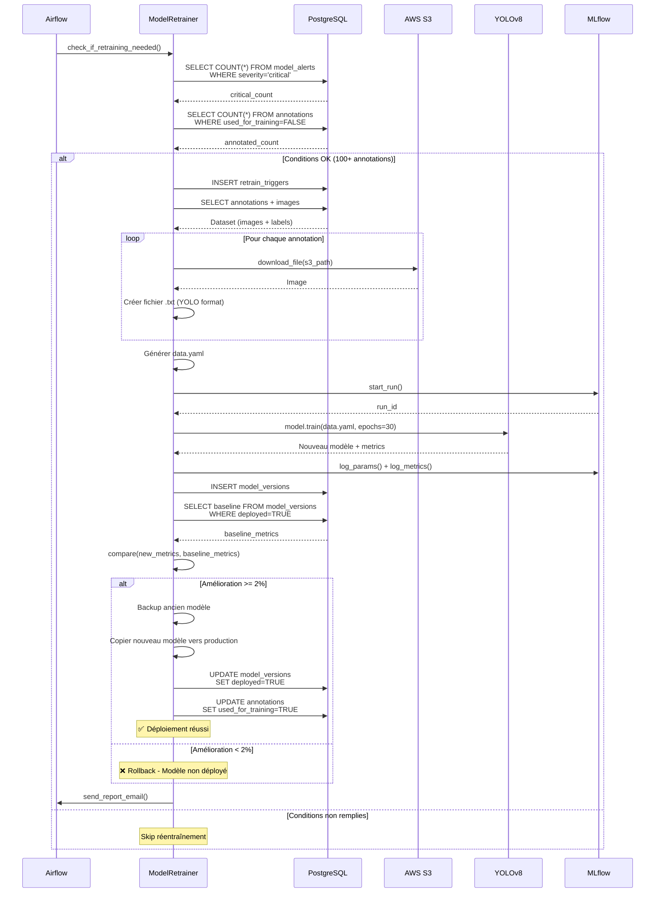

---

## 8. Architecture des Tables PostgreSQL

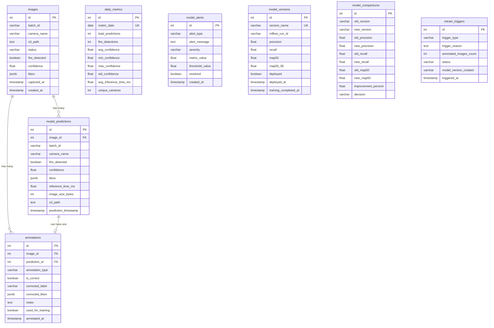

---

## 9. Timeline d'Exécution Quotidienne

```mermaid
gantt
    title Exécution Quotidienne du Système Fire Detection
    dateFormat HH:mm
    axisFormat %H:%M

    section Scraping (24/7)
    Cycle 1 (165 cams)     :00:00, 15m
    Inference Cycle 1      :00:15, 5m
    Cycle 2 (165 cams)     :00:15, 15m
    Inference Cycle 2      :00:30, 5m
    Cycle 3 (165 cams)     :00:30, 15m
    Inference Cycle 3      :00:45, 5m
    Cycle 4 (165 cams)     :00:45, 15m
    ...                    :01:00, 1m

    section Monitoring
    Calcul Métriques J-1   :09:00, 5m
    Détection Anomalies    :09:05, 2m
    Envoi Email Rapport    :09:07, 1m

    section Réentraînement
    Check Conditions       :crit, 10:00, 5m
    Préparation Dataset    :10:05, 30m
    Fine-tuning (30 epochs):10:35, 120m
    Validation             :12:35, 10m
    Déploiement            :12:45, 5m
```

---

## 10. États et Transitions - Images

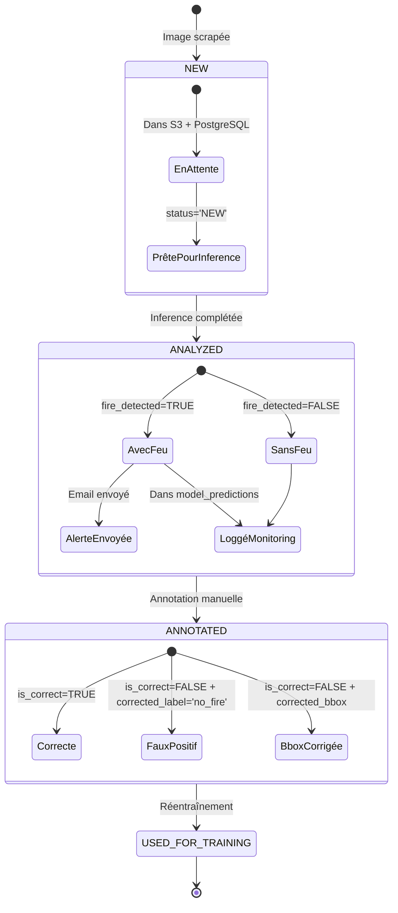

---

## 11. Décisions - Réentraînement

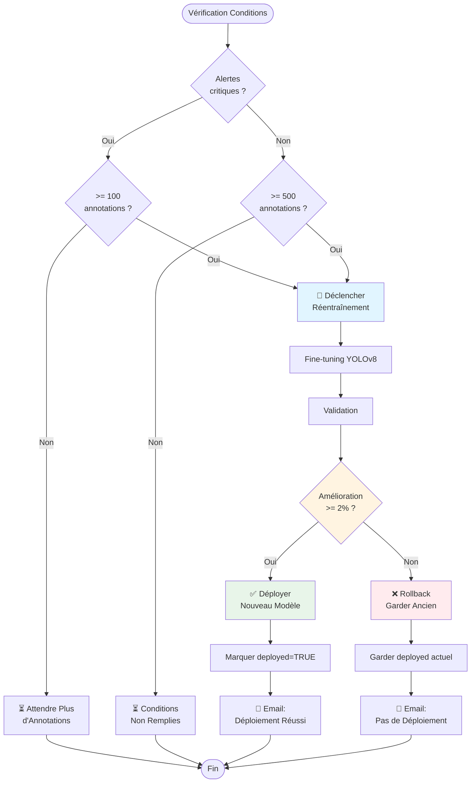

---

## 12. Infrastructure Docker

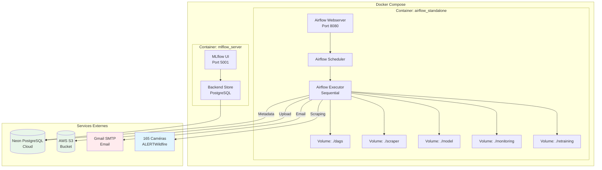

---

## Instructions d'Utilisation

### Pour visualiser sur Mermaid Live :

1. Copier un bloc de code (avec les ` ` `mermaid ... ` ` `)
2. Aller sur **https://mermaid.live/**
3. Coller le code dans l'éditeur de gauche
4. Le diagramme s'affiche automatiquement à droite
5. Cliquer sur "Actions" → "Export PNG" ou "Export SVG"

### Pour intégrer dans un README.md :

Les blocs sont déjà au bon format ! Copiez-collez directement dans votre README.md et GitHub/GitLab les afficheront automatiquement.

### Pour intégrer dans une présentation :

1. Exporter en PNG/SVG depuis Mermaid Live
2. Insérer les images dans PowerPoint/Google Slides

---

**12 diagrammes créés :**
1. Architecture globale
2. DAG fire_detection_pipeline
3. DAG model_monitoring_daily
4. DAG model_retraining
5. Flux scraping → inference (sequence)
6. Flux monitoring (sequence)
7. Flux réentraînement (sequence)
8. Architecture base de données (ERD)
9. Timeline quotidienne (Gantt)
10. États des images (state)
11. Décisions réentraînement (flowchart)
12. Infrastructure Docker

**Tous prêts à être visualisés sur https://mermaid.live/ !**
